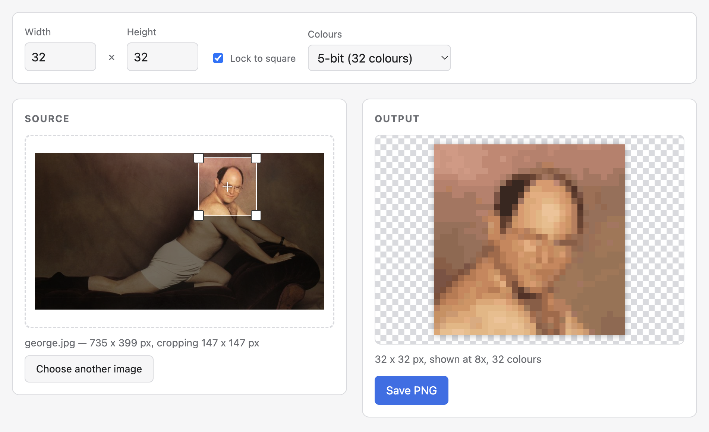

# Pixel Thing

A tool to convert images into pixelated PNG textures.



## Usage

Requires [pnpm](https://pnpm.io) (`mise install`).

```sh
pnpm install
pnpm dev
```

or

```sh
make
```

This runs the application at http://localhost:5173

Then:

1. Set the target width and height in pixels. "Lock to square" keeps them equal, and is on by default at 32 x 32.
2. Drop a JPEG or PNG onto the source pane, or click "Choose a file".
3. Drag the crop box, or its corners, to pick the area to keep. It is locked to the target's aspect ratio, so the output is never stretched or skewed.
4. Choose the **Colours**. "Actual colours" keeps every colour pixelation resolves; a depth from
   8-bit (256 colours) down to 3-bit (8 colours) restricts the output to a palette of at most that
   many colours, picked from the image itself rather than from a fixed grid.
5. Click **Save PNG**. The file downloads at exactly the target dimensions — it is never scaled up.


## Docs

See [Design](./doc/design.md).
